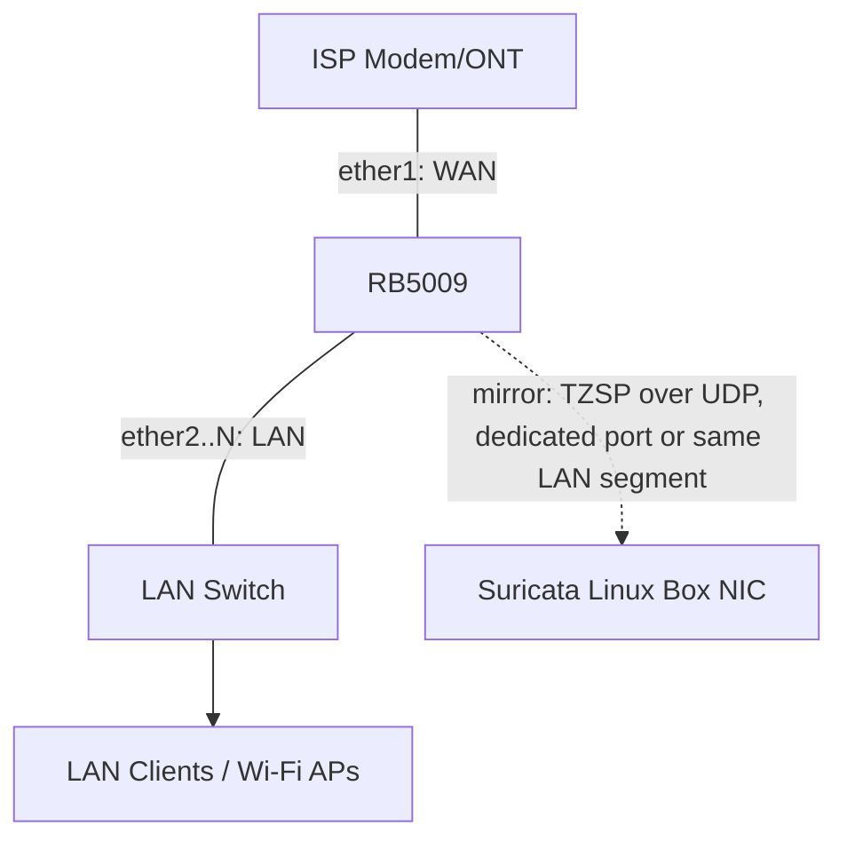

# Network Topology

## Purpose

Describes the physical/logical network layout: interfaces, VLANs (if any),
and where the mirror port and Linux capture box sit relative to the WAN and
LAN.

## Baseline topology (single WAN, single Linux box)

- `ether1` (or whichever port is WAN-facing) is the interface mirrored.
- RouterOS's `/interface mirror` (or port-mirroring via switch chip
  features on RB5009) duplicates frames seen on the WAN interface and sends
  them out as TZSP-encapsulated UDP packets to the Linux box's IP.
- The Linux box needs only one NIC for this baseline (management traffic
  and mirror traffic share it); see
  [scenario-single-wan-home-lab.md](../scenarios/scenario-single-wan-home-lab.md)
  for the fully worked configuration.

## Key interface roles on the RB5009

| Interface | Role | Notes |
|---|---|---|
| WAN interface (e.g. `ether1`) | Internet-facing | Source of mirrored traffic. |
| LAN interfaces / bridge | Internal network | Not mirrored by default (out of scope unless a scenario adds internal-threat detection). |
| Mirror target | Where TZSP packets are sent | Either a physical port dedicated to mirror output, or routed as ordinary UDP traffic to the Linux box's IP over the LAN — document which your deployment uses in `docs/scenarios/`. |

## Key interface roles on the Linux box

| Interface | Role |
|---|---|
| Physical/management NIC | Receives TZSP UDP packets from RB5009; also used for the Python app's API/Telegram calls. |
| `dummy0` (software) | Local-only interface `tzsp2pcap` writes decapsulated traffic onto (or a named pipe/pcap file, depending on chosen `tzsp2pcap` mode) so Suricata can capture from something interface-shaped. |

## Variants

Dual-WAN, multiple mirror sources, or multiple Suricata boxes are covered
as their own scenario docs — see
[docs/scenarios/README.md](../scenarios/README.md). Do not bake
multi-WAN assumptions into the baseline docs; keep the baseline minimal and
layer variants as separate scenario documents.

## See also

- [overview.md](overview.md)
- [data-flow.md](data-flow.md)
- [docs/setup/01-mikrotik-rb5009-port-mirroring.md](../setup/01-mikrotik-rb5009-port-mirroring.md)
