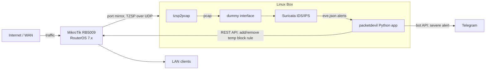

# Architecture Overview

## Purpose

High-level system design for `packetdevil`: what each component is, why it
exists, and how data flows between components. Read this before any
`docs/setup/` guide — it gives the mental model those guides assume.

## Components

| Component | Runs on | Role |
|---|---|---|
| RouterOS port mirror | MikroTik RB5009 | Duplicates all WAN-facing traffic to a mirror port/interface, TZSP-encapsulated. |
| `tzsp2pcap` (vendored + patched) | Linux (Suricata box) | Receives TZSP UDP packets, strips TZSP encapsulation, emits raw pcap (to file, FIFO, or directly to an interface/socket Suricata reads from). |
| `dummy` interface | Linux (Suricata box) | Local interface Suricata listens on so it behaves like a normal NIC capture, decoupling Suricata from the TZSP protocol entirely. |
| Suricata | Linux (Suricata box) | IDS/IPS engine; inspects traffic against rules, emits alerts to `eve.json`. |
| `packetdevil` Python app | Linux (Suricata box, or elsewhere with network access to both Suricata's log and the router) | Tails `eve.json`, classifies alerts, calls RouterOS firewall API for temporary blocks, sends Telegram alerts for severe threats. |
| RouterOS Firewall API | MikroTik RB5009 | REST API (RouterOS 7.x `/rest` or legacy API port) used to create/remove temporary firewall filter rules. |
| Telegram Bot API | External (Telegram) | Delivers human-facing alerts for high-severity detections. |

## Why this design

- **Mirroring, not inline bridging.** Suricata runs in a passive/IDS role
  reading a *copy* of traffic (via TZSP mirror), not inline as an IPS on the
  router's main data path. This avoids the RB5009 becoming a bottleneck or
  single point of failure for internet connectivity, at the cost of active
  blocking requiring a round-trip through the Python app + firewall API
  instead of Suricata dropping packets directly. See
  [decisions/0002-suricata-deployment.md](decisions/0002-suricata-deployment.md).
- **tzsp2pcap is vendored + patched, not rewritten from scratch or used as
  an external dependency.** See
  [decisions/0001-tzsp2pcap-fork-strategy.md](decisions/0001-tzsp2pcap-fork-strategy.md).
- **Firewall rules are temporary (TTL-based).** Automated blocking always
  carries risk of false positives; auto-created rules expire and require a
  human-reviewed allowlist/denylist to become permanent.

## Diagram

## See also

- [network-topology.md](network-topology.md)
- [data-flow.md](data-flow.md)
- [docs/setup/](../setup/) for build-out order
- [docs/reference/glossary.md](../reference/glossary.md)
